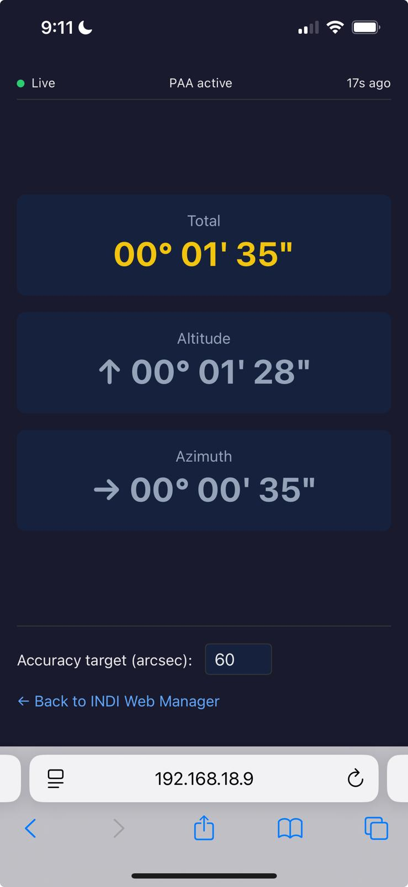
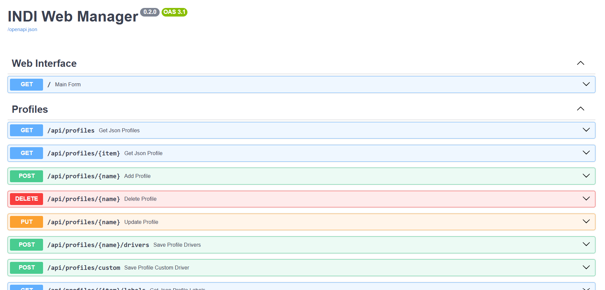

# INDI Web Manager

INDI Web Manager is a simple Web Application to manage [INDI](http://www.indilib.org) Server.

It supports multiple driver profiles
along with optional custom remote drivers. It can be used to start INDI server
locally, and also to connect or **chain** to remote INDI servers.


The Web Application is based on [FastAPI](https://fastapi.tiangolo.com/)
micro-framework. It has a built-in webserver and by default listens on port 8624.

# Installation

Before installing the **indiweb** package, make sure the INDI library is
installed on the target system.

You can install the **indiweb** Python package using pip:

```
$ pip install indiweb
```

You may want to install it system-wide, only in your user account or even into
a [virtual environment](https://virtualenv.pypa.io/en/stable/) (if you are a
developer).

If you want to install it system-wide, you will have to invoke pip with
superuser rights:

```
$ sudo pip install indiweb
```

# Usage

After installing the **indiweb** package, the command **indi-web** will be
available in your system PATH.

You can obtain help about the **indi-web** command by invoking:

```
$ indi-web -h
```

The INDI Web Manager runs as a standalone web server. It can be started
manually by invoking:

```
$ indi-web -v
```

Then using your favorite web browser, go to
[http://localhost:8624](http://localhost:8624) if the INDI Web Manager is
running locally. If the INDI Web Manager is installed on a remote system,
simply replace localhost with the hostname or IP address of the remote system.

# PAA Live Monitor

The PAA (Polar Alignment Assistant) live monitor is an optional feature that
shows **live** polar alignment error from Ekos/KStars. It displays total,
altitude, and azimuth error in degrees-minutes-seconds (DMS) and arcseconds,
with direction arrows; values update as Ekos writes PAA Refresh lines to its
log file.



To enable the PAA monitor, start INDI Web Manager with `--with-paa`. You may
optionally pass one or more log directories with `--kstars-logs DIR [DIR ...]`.
If `--kstars-logs` is omitted, the application searches (in order):
`~/.local/share/kstars/logs` (native KStars install) and
`~/.var/app/org.kde.kstars/data/kstars/logs` (Flatpak). Example:
`indi-web --with-paa` or `indi-web --with-paa --kstars-logs /path/to/kstars/logs`.

**Ekos configuration (required):** In Ekos, enable **Log to file** so that PAA
Refresh lines are written to the KStars log. Run the **Polar Alignment
Assistant** in Ekos so the log contains PAA data. Without Log to file enabled,
the monitor will report that no PAA data was found and prompt you to enable it.

Open the PAA page in the app at [http://localhost:8624/paa](http://localhost:8624/paa)
(when using the default port). Status is also available via REST at
`GET /api/paa/status` and live updates via WebSocket at `/ws/paa` for integration.

# Auto Start

If you selected any profile as **Auto Start** then the INDI server shall be
automatically started when the service is executed at start up.

# Auto Connect

Similary to Auto Start, **Auto Connect** would connect all the drivers after
the server is up and running.

# Start vs. Connect

What is the difference between _starting_ a driver and _connecting_ a driver?

- Start: The INDI server executes the driver. The driver starts up and provide a list of properties. It does not establish connection with the physical device.
- Connect: Establish connection to the physical device.

# Systemd configuration

The provided file `indiwebmanager.service` is an example _systemd service file_
that can be used to run `indi-web` at startup as _pi_ user. If your username is different
please edit the file and change the username first.

Indiwebmanager must be installed system-wide:

```
sudo pip install indiweb
```

Copy your preferred service file to `/etc/systemd/system`:

```
sudo cp indiwebmanager.service /etc/systemd/system/
sudo chmod 644 /etc/systemd/system/indiwebmanager.service
```

Now configure systemd to load the service file during boot:

```
sudo systemctl daemon-reload
sudo systemctl enable indiwebmanager.service
```

Finally, reboot the system for your changes to take effect:

```
sudo reboot
```

After startup, check the status of the INDI Web Manager service:

```
sudo systemctl status indiwebmanager.service
```

If all appears OK, you can start using the Web Application using any browser.

# Profiles

The Web Application provides a default profile to run simulator drivers. To use
a new profile, add the profile name and then click the plus button. Next,
select which drivers to run under this particular profile. After selecting the
drivers, click the **Save** icon to save all your changes. To enable automatic
startup of INDI server for a particular profile when the device boots up or
when invoked manually via the **systemctl** command, check the **Auto Start**
checkbox.

## API Documentation

INDI Web Manager now uses FastAPI, which automatically generates interactive API documentation.

To access the API documentation, navigate to the `/docs` endpoint (Swagger UI) or the `/redoc` endpoint (ReDoc) in your web browser after starting the application.

For example, if the INDI Web Manager is running locally on port 8624, you can access the documentation at:

[http://localhost:8624/docs](http://localhost:8624/docs) or [http://localhost:8624/redoc](http://localhost:8624/redoc)

The `/docs` and `/redoc` pages provide user-friendly interfaces to explore the available API endpoints, their parameters, and expected responses. You can also directly interact with the API from the `/docs` page to test the endpoints.



## Development

Create and use a virtual environment to avoid installing into system Python:

```bash
python3 -m venv .venv
.venv/bin/pip install -e ".[dev]"
```

Then run indiweb:

```bash
.venv/bin/python -m indiweb.main
```

Run tests (use the venv):

```bash
.venv/bin/pytest tests/ -v
```

Unit and API tests run by default. Integration tests (in `tests/test_integration.py`) require `indiserver` and simulator drivers; they are skipped if not installed. To run only unit/API tests:

```bash
.venv/bin/pytest tests/ -m "not integration" -v
```

To run integration tests (with INDI installed):

```bash
.venv/bin/pytest tests/ -m integration -v
```

Run all Python versions via tox:

```bash
.venv/bin/tox run -e py39,py310,py311,py312
```

With coverage (local):

```bash
.venv/bin/pytest tests/ -m "not integration" --cov=indiweb --cov-report=term-missing --cov-report=html
```

With coverage (Docker, recommended so `htmlcov/` is owned by you):

```bash
./scripts/docker-test.sh
```

Or manually: `DOCKER_UID=$(id -u) DOCKER_GID=$(id -g) docker compose run --rm test`

Coverage is printed in the terminal and an HTML report is written to `htmlcov/`. Open `htmlcov/index.html` in a browser to view it.

Or activate the venv first: `source .venv/bin/activate`, then run `pytest`, `tox`, etc.

# Authors

Jasem Mutlaq (mutlaqja@ikarustech.com)

Juan Menendez (juanmb@gmail.com)
